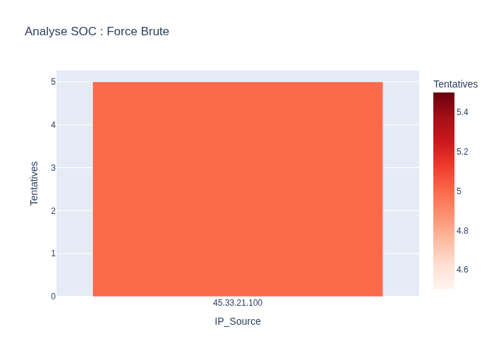

# 🛡️ Projet SOC : Détection d'Intrusions avec Python

Ce projet simule un système de détection d'intrusions (IDS) qui analyse les journaux de trafic réseau pour identifier les attaques par force brute.

## 📊 Fonctionnalités
* Analyse automatique des fichiers `network_traffic.log`.
* Détection des tentatives de connexion échouées.
* Visualisation des données avec Plotly.

## 📈 Résultat de l'Analyse

## 🛠️ Technologies utilisées
* Python 3
* Pandas (Data Science)
* Plotly (Visualisation)
* Kali Linux
